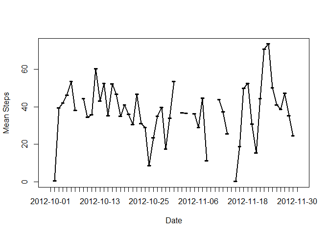
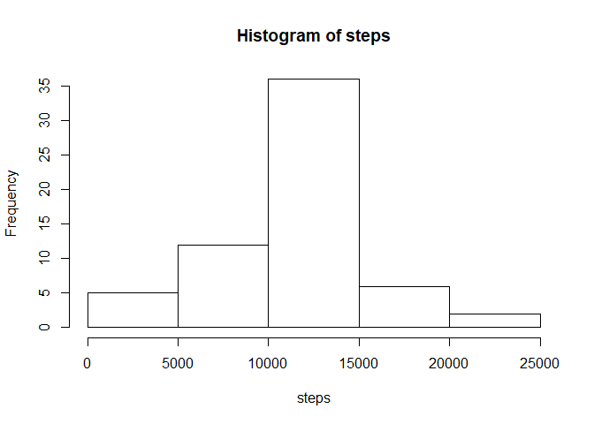

```r
## Loading and preprocessing the data

activity <- read.csv("activity.csv")
```

## What is mean total number of steps taken per day?

```r
#calculate sum of steps for each day
stepsperDay = aggregate(x=activity$steps,by=list(activity$date),FUN=sum)
#Rename columns of resulting dataframe
names(stepsperDay) = c("date","steps")
#Histogram of number of steps:
with(stepsperDay,hist(steps))
```

<!-- -->

```r
#Mean steps per day:
mean(stepsperDay$steps,na.rm=T)
```

```
## [1] 10766.19
```

```r
#Median steps per day:
median(stepsperDay$steps,na.rm=T)
```

```
## [1] 10765
```
## What is the average daily activity pattern?

```r
#calculate mean of steps for each day
meanstepsperDay = aggregate(x=activity$steps,by=list(activity$date),FUN=mean)
#Rename columns of resulting dataframe
names(meanstepsperDay) = c("date","steps")
#create time series of mean steps
with(meanstepsperDay,plot(date,steps,type="l",xlab="Date",ylab="Mean Steps"))
#add line to plot
with(meanstepsperDay,lines(date,steps,type="l", lwd=2))
```

<!-- -->

```r
#5 MIN INTERVAL WITH MOST STEPS:
meanstepsperInterval = aggregate(x=activity$steps,by=list(activity$interval),FUN=mean,na.rm=T)
names(meanstepsperInterval) = c("interval","steps")
meanstepsperInterval[which.max(meanstepsperInterval$steps),]
```

```
##     interval    steps
## 104      835 206.1698
```

## Imputing missing values

```r
##Total number of Missing Values:
sum(is.na(activity$steps))
```

```
## [1] 2304
```

```r
#find mean for each interval:
meanstepsperInterval = aggregate(x=activity$steps,by=list(activity$interval),FUN=mean,na.rm=T)
names(meanstepsperInterval) = c("interval","steps")
#Create new vector identical to activity to do imputing on
activityfilled <- activity
#Iterate through new vector, if steps=NA then replace with the mean for that interval in the whole data
for(i in 1:nrow(activityfilled)){
  if(is.na(activityfilled[i,]$steps)){
    activityfilled[i,]$steps <- meanstepsperInterval[meanstepsperInterval$interval==activityfilled[i,]$interval,]$steps
  }  
}
#total number of steps:
totalstepsperDay = aggregate(x=activityfilled$steps,by=list(activity$date),FUN=sum)
names(totalstepsperDay) = c("date","steps")
#histogram:
with(totalstepsperDay,hist(steps))
```

<!-- -->

```r
mean(totalstepsperDay$steps)
```

```
## [1] 10766.19
```

```r
median(totalstepsperDay$steps)
```

```
## [1] 10766.19
```
The mean is the same before imputing as we used the mean for the interval for missing values.  The median is slightly higher.

## Are there differences in activity patterns between weekdays and weekends?

```r
activityfilled$day=ifelse(as.POSIXlt(as.Date(activityfilled$date))$wday%%6==0,"weekend","weekday")
# factor this
activityfilled$day=factor(activityfilled$day,levels=c("weekday","weekend"))
#aggreagte by intreval and whether a weekday
stepsInterval2=aggregate(steps~interval+day,activityfilled,mean)
#Create time series for weekday/weekend cases
library(lattice)
xyplot(steps~interval|factor(day),data=stepsInterval2,aspect=1/2,type="l")
```

<!-- -->
